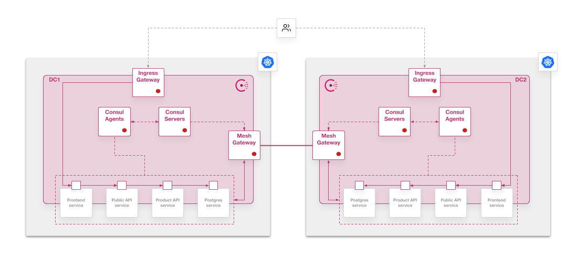
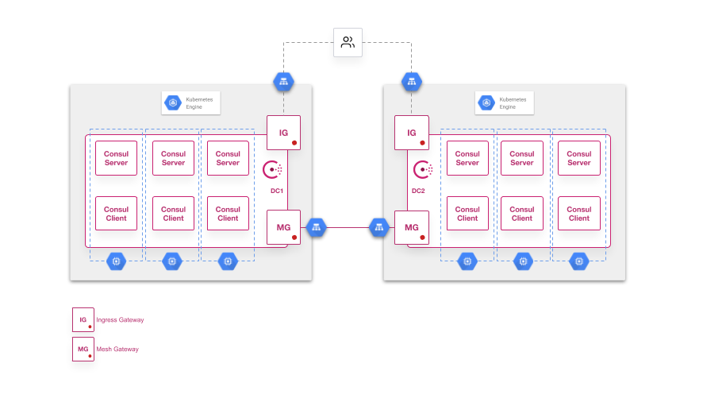

# Deploy Federated Consul clusters on GKE with Terraform

> Note: This is not an official HashiCorp repositoiry and it is still a WIP...

## Consul Federation Context
We can deploy application services in several Kubernetes clusters and use Consul Federation cluster capabilities and Service Mesh features to communicate registered services and work in a geo-failover scenario:



The deployment architecture in GKE considering 3 nodes clusters, like you would deploy in this Terraform Configuration, is shown in the following diagram:



## The repository content

### Requirements

* Terraform 0.13+ (and a [Terraform Cloud account](https://app.terraform.io/signup/account) if you use Terraform Cloud/Enterprise)
* GCP account and resource permissions in a GCP project:
  * Container Engine permissions to create and admin GKE clusters
  * GCS bucket permissions to upload your Consul configuration files (you need to create the bucket first)
* In case of deploying Consul Enterprise you will need a valid license

### Terraform configuration
This Terraform configuration is based on the following actions and parameters

* It calls a GKE Module stored in GitHub to deploy GKE clusters
* It uses an internal Kubernetes module that creates resources and install Consul Enterprise using the official Helm chart
* It needs some variables values that can be defined in a `terraform.auto.tfvars` file:
  * `gcp_region` : The GCP region to deploy your clusters
  * `gcp_project` : Your GCP project where you have permissions to deploy
  * `node_type` : VM instance size for K8s nodes
  * `gcp_zone` : GCP zone where deploying clusters
  * `gke_cluster` : Name **prefix** for your GKE clusters names. `0` and `1` suffix will be appended depending on the number of the cluster (`1` for the second clueter if creating the federated cluster)
  * `numnodes` : Number of Kubernetes nodes (default is *3*)
  * `regional_k8s` : Set it to true if you want regional GKE clusters (default is *false*)
  * `owner` : To create a tag with the owner for the clusters
  * `gcs_bucket` : An existing GCS bucket where saving the yaml values for Consul clusters
  * `service_account` : (*Not needed at the moment*)
  * `default_gke` : Set this to *true* if you want to use a default node pool. It is not the common recommended approach, but it is faster to deploy for demo purposes (default is *false*)
  * `default_network` : Set this to *true* if you want to use the `default` GCP network. If not it will create a VPC network in GCP to isolate each cluster (default is *false*)
  * `dns_zone` : This is not used at the moment (it will allow you to create a Google DNS record to access your Consul UI via FQDN)
  * `consul_license` : Consult Enterprise license key (**right now it is mandatory because we are using Enterprise version**)
  * `create_federation` : To create a federated cluster. If you just want to deploy one Consul cluster without federation set this to *false* (default is *true*)
  * `consul_enterprise` : Set this to true to deploy Consul Enterprise and enable by default its features (default is *false*)
  * `consul_version` : Specify the version of Consul (1.8.0+)
  * `chart_version` : Specify version of Helm Chart according to the [compatibility matrix](https://www.consul.io/docs/k8s/upgrade/compatibility)
* It uses some `yaml` files values  in the [`templates` directory](./templates) in the root module

## Deploy Consul

If you want to use Terraform Cloud/Enterprise uncomment the following lines from `main.tf` and replace your `organization` and `workspace` values:
  ```
  # backend "remote" {
  #   hostname = "app.terraform.io"
  #   organization = "my_org"

  #   workspaces {
  #     name = "my_workspace"
  #   }
  # }
  ```

From the root of this repo, initialize your Terraform configuration:
```bash
terraform init
```

After Terraform is initialized, create a `terraform.auto.tfvars` file with your parameter values (you can edit the `terraform.auto.tfvars.template` with your values and rename it). If you are using Terraform Cloud/Enterprise with a [remote execution](https://www.terraform.io/docs/cloud/run/index.html) upload your [variables in Terraform Cloud](https://www.terraform.io/docs/cloud/workspaces/variables.html).

Once your variables are set and backend is initialized, you can deploy Consul on GKE:

```bash
terraform apply
```

Check the plan shown in the output and type `yes` to confirm deployment... You are all set, you only need to wait till all resources are deployed in GKE and Kubernetes resources are ready.

> NOTE: Depending on `create_federation` variable you will have one or two clusters:
> * `create_federation = true` Creates 2 GKE clusters and deploys a primary Consul datacenter and a secondary federated Consul datacenter
> * `create_federation = false` Creates 1 GKE cluster and it deploys Consul with federation configuration ready as primary if you want to configure a secondary federated cluster by your own

> NOTE (Enterprise version): You can use Consul Enterprise by defining the variable `consul_enterprise = true`. By using the Enterprise binary the configuration defined in this repo will show the use case of working with namespaces by enabling the `mirroringK8s` parameter, which will use a Consul namespace matching with the Kubernetes namespace where application services are deployed.
